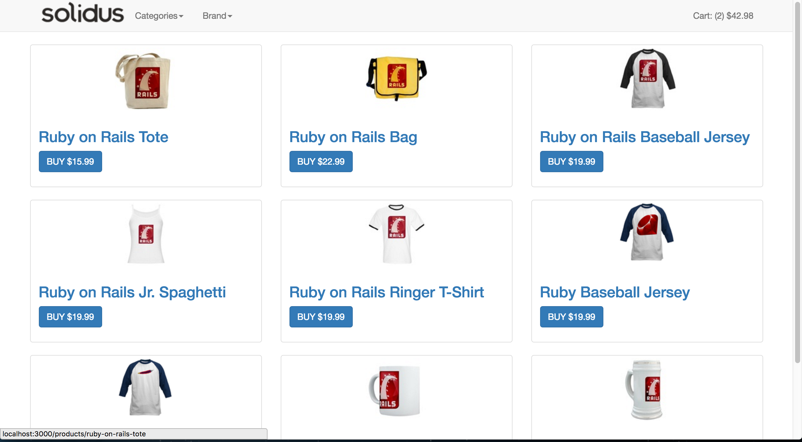
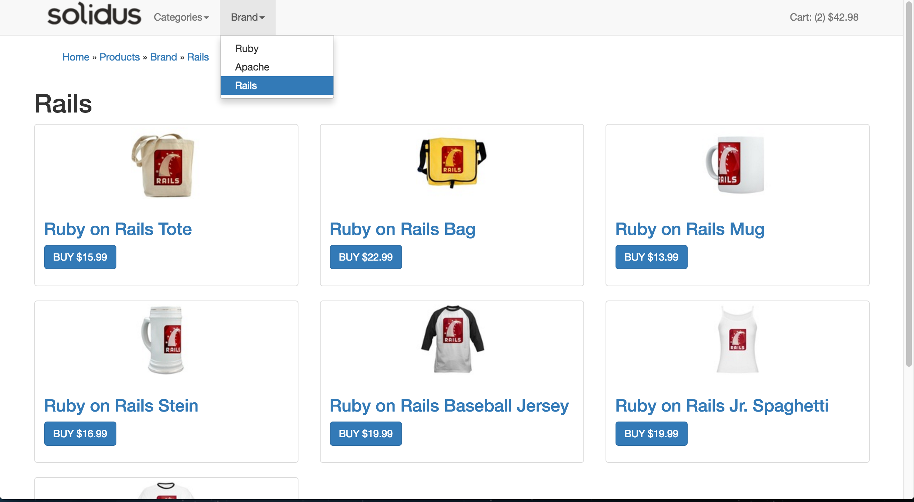
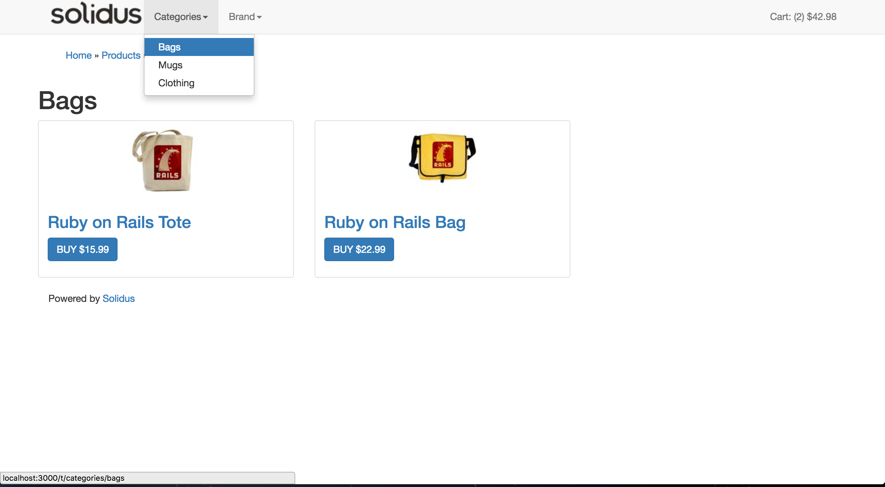
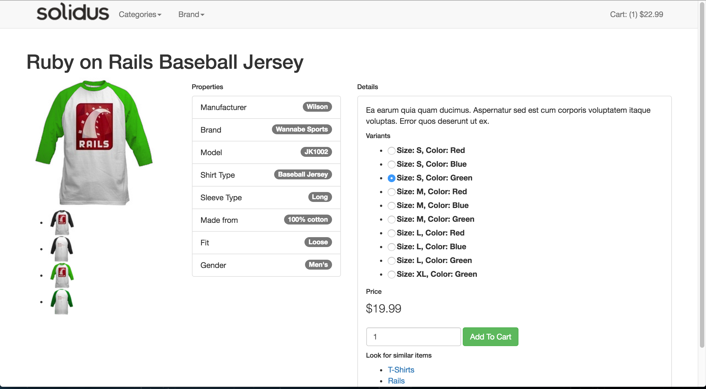
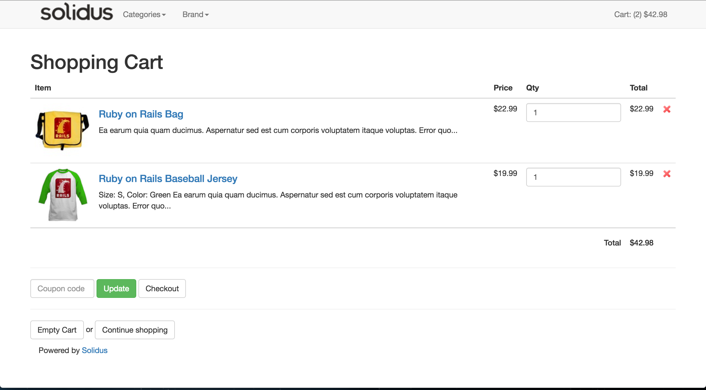

# MyStore

### PROJECT SUMMARY

```
An eCommerce application for high volume retailers. 
Built with Ruby on Rails and an open source gem called Solidus. Solidus is a 
mountable engine provides a scalable, stable, and highly customizable platform
for online commerce.

Project objective is to reconstruct the layouts with bootstrap in order to obtain
a better UI/UX for future project use.
```

- ~~solidus_api (RESTful API)~~
- **solidus_frontend (Cart and storefront)** *Mainly focus on*
- ~~solidus_backend (Admin area)~~
- ~~solidus_core (Essential models, mailers, and classes)~~
- ~~solidus_sample (Sample Data)~~

## GEM USED


## FRAMEWORKS & LANGUAGES USED


## PROJECT SCREENSHOT











